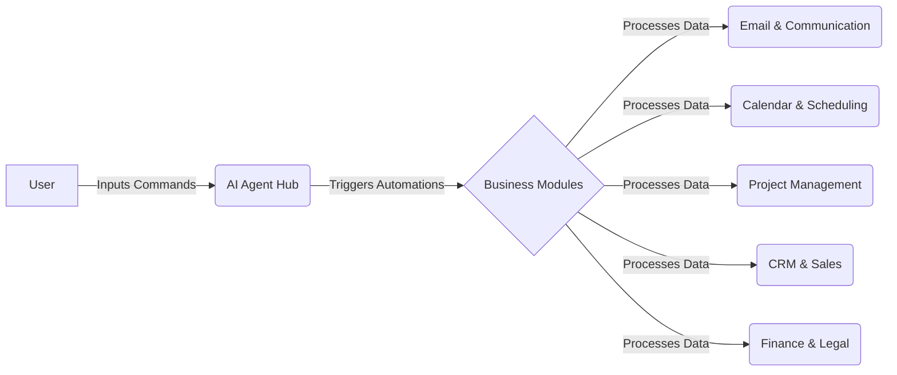
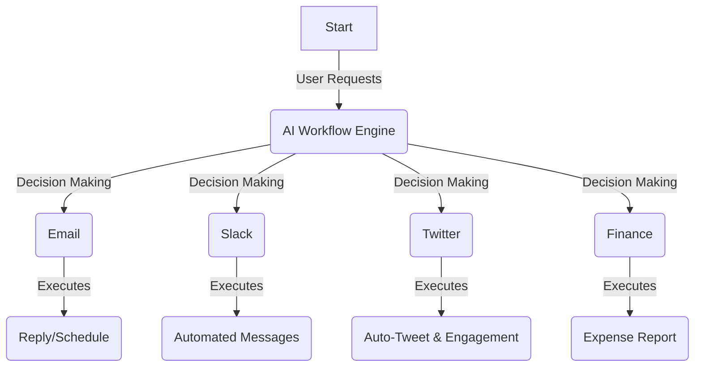
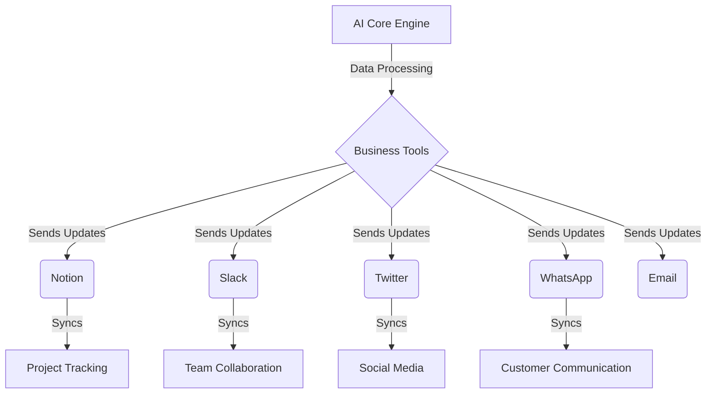
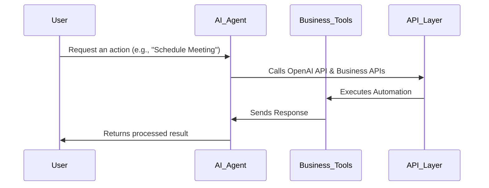

# AI-Powered Management & Business Automation Suite

# Demo Video Link: https://youtu.be/gYxsbM0XOdo?si=3ZRBzajkdxQlq2k3

## 🚀 The Ultimate AI Business Automation Tool

**AI-Powered Management & Business Automation Suite** is an all-in-one AI-driven platform designed to automate every aspect of business operations. From **emails, calendars, Notion, Slack, Twitter, WhatsApp, SMS**, and beyond, our AI agents take care of everything, all while continuously learning via **reinforcement learning** to optimize efficiency and decision-making.

> **⚠️ OpenAI API Key Required** – Ensure you have an active OpenAI API key to enable AI-driven automation.

---

## 🌟 Features

✅ **AI Email Assistant** – Auto-draft, summarize, and prioritize emails  
✅ **AI Calendar & Meeting Scheduler** – Smart scheduling with conflict resolution  
✅ **AI Notion Assistant** – Auto-generate structured notes & knowledge retrieval  
✅ **AI Slack & Workplace Chatbot** – Intelligent chat summaries & smart replies  
✅ **AI Twitter & Social Media Manager** – Automated post scheduling & trend analysis  
✅ **AI WhatsApp & SMS Automation** – AI-driven customer support & smart replies  
✅ **AI Meeting Transcription & Action Points** – Real-time transcription & report generation  
✅ **AI Workflow Automation Engine** – Cross-platform automation & business rule engine  
✅ **AI-Based Sales & CRM Enhancer** – Lead tracking, auto-follow-ups & forecasting  
✅ **AI Financial & Expense Management** – Auto-expense tracking & fraud detection  
✅ **AI HR & Talent Management** – Resume screening, sentiment analysis & performance tracking  
✅ **AI Legal & Compliance Checker** – Contract analysis, risk detection & legal automation  
✅ **AI Cybersecurity & Threat Detection** – AI-powered phishing protection & anomaly detection  
✅ **AI Personal Business Assistant** – Smart task prioritization & auto-reports  
✅ **AI Sentiment & Reputation Management** – Social sentiment monitoring & crisis response  

---

## 🏗️ System Architecture

---

## 🔄 Workflow Automation

---

## 🌎 Cross-Platform Integration

---

## 🤖 AI Model Workflow

---

## 📌 Why This Matters?
- **🚀 Automates Everything** – Say goodbye to manual workflows! AI handles it all.
- **📡 100% AI-Driven** – Every feature runs on cutting-edge AI models.
- **📊 Enterprise-Grade** – Scalable for businesses of all sizes.
- **🔗 Seamless Integrations** – Works with all major platforms & tools.
- **🧠 Continuous Learning** – AI agents evolve over time, improving efficiency and decision-making through **reinforcement learning**.

---

💡 **This is just the beginning.** AI-powered business management is the future, and we’ve built the ultimate toolkit to lead the way! 🔥

